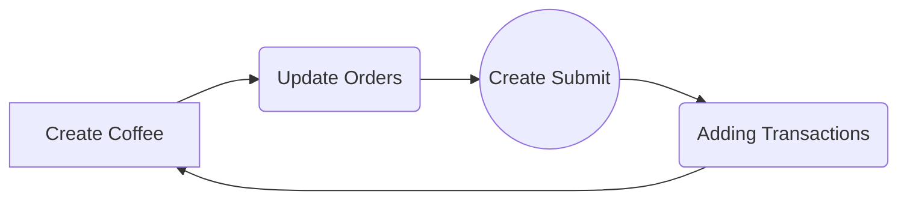

# This is easy-Coffee-Order-Maker

###    Coffee Order Maker...  

Hi! Coffee Order Maker is really simple electron-cli app. 

### How to run
```$ npm install ```
```$ npm start ```

(or) 

```$ yarn install ```
```$ yarn start ```

###  How to play in Electron

Really Easy to Start with Coffee-Order_Maker:


